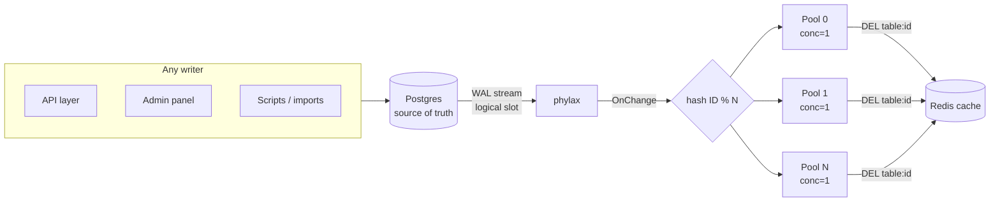

# redis-cdc-invalidation

Keep a Redis cache in sync with Postgres automatically. Instead of clearing the cache in every write path, this watches Postgres's write-ahead log (WAL) and deletes the matching Redis key on every insert, update, and delete — from any writer, with zero polling.

## The problem

A cache is only correct if every write path remembers to invalidate it: API handlers, admin panels, one-off scripts, bulk imports, migrations. Miss one path and you serve stale data indefinitely — and the miss is silent, so you find out from users, not alerts. As writers multiply, manual invalidation rots.

This project flips the responsibility: instead of every writer notifying the cache, one watcher observes committed data and invalidates. New writers are covered automatically because coverage comes from the database, not from code paths.

## How it works



`Write → Postgres commits → phylax reads WAL → hash routes to pool → worker DELs the key → next read repopulates from Postgres`

Each stage exists for a specific reason:

- **Postgres WAL (not triggers, not polling).** Every committed change is already in the write-ahead log, so watching it adds no overhead to writes and never misses a commit. Triggers would tax every write; polling would always be late.
- **Replication slot (not a plain connection).** The slot (`my_slot`) forces Postgres to retain WAL until this app acknowledges it. If the app restarts, it resumes where it left off. Without the slot, downtime means silently missed writes.
- **phylax (not hand-rolled replication).** Logical replication's sharp edges — slot/publication lifecycle, keepalives, standby-status timing, reconnect with backoff, LSN resume — are handled by the library. The app implements one callback: `OnChange`.
- **Hash router (not random dispatch).** `pool = fnv32a(id) % N` sends every change for one row ID to the same pool, so per-key order is preserved, while different IDs scatter across pools for parallelism. Same trick as Kafka partition keys. FNV because it needs to be fast and deterministic, not cryptographic.
- **One worker per pool (not a shared thread pool).** Each pond pool runs a single task at a time, so two rapid updates to the same row invalidate in commit order. Raise a pool to 2+ workers and an older state can win the race — the design collapses to "usually correct," which is broken. Across pools, all N run concurrently.
- **`DEL` (not recompute).** Delete-then-lazy-repopulate is one Redis round trip with no serialization code to rot, and it is idempotent — replayed WAL events are harmless. Recompute only pays off for keys so hot a cold miss hurts; measure before switching.
- **TTL backstop (not the primary path).** Cached rows expire after 5 minutes, so even a missed `DEL` self-heals. `DEL` does the real work; TTL bounds the worst case.

## Reads: cache-aside

`getProduct` checks Redis first. On a miss (or corrupt entry, or Redis being down) it reads Postgres and repopulates Redis:

```go
p, err := getProduct(ctx, rdb, pool, "p1")
if errors.Is(err, ErrProductNotFound) {
    // id exists in neither cache nor Postgres; misses are never cached
}
```

Cache trouble degrades to Postgres instead of failing the read. A failed `SET` doesn't fail a good row — the next read simply misses again.

## Cache keys

Keys are `<table>:<id>` (e.g. `products:p1`, `orders:o1`), derived from the change event itself. Watching a new table needs no code change — add it to `TABLES` (plus a one-time `ALTER PUBLICATION my_publication ADD TABLE <table>;`).

## Quick start

Requirements: Postgres with `wal_level = logical`, and Redis or Valkey on `localhost:6379`.

```sh
# from the repo root
DATABASE_URL='postgres://postgres@localhost:5432/redis_cdc' go run .
```

This starts the WAL watcher plus a console at `http://localhost:8080/dashboard` (KPIs, lag sparkline, live change feed, with `/metrics/stream` and `/events` alongside).

Now write a row from anywhere — psql, your app, a script:

```sql
INSERT INTO products (id, name) VALUES ('demo1', 'apple');
UPDATE products SET name = 'APPLE' WHERE id = 'demo1';
```

The app logs each invalidation with its worker, e.g. `invalidated products:demo1 pool=5 (insert)` — same key, same pool every time — and the dashboard's `changes_processed` ticks up per write.

## Configuration

| Variable | Default | Meaning |
|---|---|---|
| `DATABASE_URL` | _(empty)_ | Postgres DSN. Empty means start nothing (handy for running unit tests without a DB). |
| `TABLES` | `products` | Comma-separated tables to watch, e.g. `products,orders`. |
| `REDIS_ADDR` | `localhost:6379` | Redis/Valkey address. Pinged at startup — fail fast if unreachable. |
| `HTTP_ADDR` | `:8080` | Console address. |
| `WORKER_POOLS` | `8` | Router pool count. Must be a positive int; anything else is a startup error. Pools hold no state, so changing this across a restart loses and reorders nothing. |

## Monitoring

`cdcStream` supervises replication and the console as one unit: either side dying takes the other down, and Ctrl-C shuts both down gracefully. While running, watch:

- `changes_processed` — should tick once per committed row change; compare against your write rate.
- `changes_dropped` — must stay 0; drops mean a subscriber can't keep up.
- `replication_lag_bytes` — a plateau during writes is pipeline depth; a climb means the consumer is falling behind; check `pg_replication_slots` on Postgres if it grows while this app is stopped.
- App log lines — every invalidation prints its key, pool, and operation, so the sharding is visible, not trusted.

## Tests

```sh
go test -race ./...
```

Pure unit tests (hash stability, cross-key spread, same-key ordering under `-race`, key format, pool-count defaults) always run. Tests touching Postgres/Redis use the local defaults above and skip when unreachable. The live suite proves the whole contract: miss populates, hit serves stale, invalidate refreshes, unknown IDs stay uncached.

## Things to watch out for

- **Lag is inherent, not zero.** Commit → WAL → handler → Redis is milliseconds. If a path needs read-your-write, add a targeted inline invalidation there alongside CDC.
- **`REPLICA IDENTITY`.** With the default, Postgres ships old-row data only for primary-key changes. Deletes and key updates work; if you ever need old non-key values (e.g. "invalidate the old category listing too"), set `REPLICA IDENTITY FULL` and accept the extra WAL.
- **Slot lag.** While this process is stopped, WAL accumulates in `my_slot`. Alert on slot growth, or restarts replay a mountain.
- **Hot keys.** After `DEL` on a very hot key, concurrent reads can stampede Postgres to repopulate. Mitigate with `singleflight` at the read path if you measure it.
- **At-least-once delivery.** Restarts replay unacknowledged changes. `DEL` is idempotent so replays are harmless — keep any future handlers idempotent too.
- **Shutdown.** Ctrl-C (SIGINT) stops replication and the console gracefully. Plain `kill` (SIGTERM) terminates without the graceful path. Also note: `kill %1` won't stop a `go run` child in scripts — kill the `exe/pkg` PID.
- **Key format.** Keys are `products:p1`, not `product:p1`. Don't mix binaries across the rename.

## Project layout

| File | Responsibility |
|---|---|
| `main.go` | Wiring: env config, phylax watcher, supervised console, `rowID` extraction |
| `router.go` | Hash dispatch to N single-worker pools (`Owner`, `Dispatch`, `StopAndWait`) |
| `cache.go` | Redis client, `<table>:<id>` keys, idempotent `DEL` |
| `store.go` | Cache-aside `getProduct`, TTL backstop, `ErrProductNotFound` |
| `router_test.go`, `cache_test.go`, `store_test.go` | Unit + live tests (live ones skip without local PG/Redis) |
