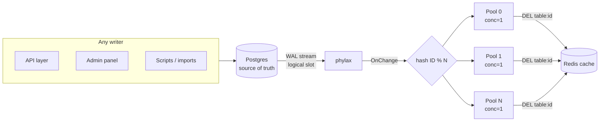

# redis-cdc-invalidation

Keep a Redis cache in sync with Postgres automatically. Instead of clearing the cache in every write path, this watches Postgres's write-ahead log (WAL) and deletes the matching Redis key on every insert, update, and delete — from any writer, with zero polling.

## The problem

A cache is only correct if every write path remembers to invalidate it: API handlers, admin panels, one-off scripts, bulk imports, migrations. Miss one path and you serve stale data indefinitely — and the miss is silent, so you find out from users, not alerts. As writers multiply, manual invalidation rots.

This project flips the responsibility: instead of every writer notifying the cache, one watcher observes committed data and invalidates. New writers are covered automatically because coverage comes from the database, not from code paths.

## How it works



`Write → Postgres commits → phylax reads WAL → hash routes to pool → worker DELs the key → next read repopulates from Postgres`

Each stage exists for a specific reason:

- **Postgres WAL (not triggers, not polling).** Every committed change is already in the write-ahead log, so watching it adds no overhead to writes and never misses a commit. Triggers would tax every write; polling would always be late.
- **Replication slot (not a plain connection).** The slot (`my_slot`) forces Postgres to retain WAL until this app acknowledges it. If the app restarts, it resumes where it left off. Without the slot, downtime means silently missed writes.
- **phylax (not hand-rolled replication).** Logical replication's sharp edges — slot/publication lifecycle, keepalives, standby-status timing, reconnect with backoff, LSN resume — are handled by the library. The app implements one callback: `OnChange`.
- **Hash router (not random dispatch).** `pool = fnv32a(id) % N` sends every change for one row ID to the same pool, so per-key order is preserved, while different IDs scatter across pools for parallelism. Same trick as Kafka partition keys. FNV because it needs to be fast and deterministic, not cryptographic.
- **One worker per pool (not a shared thread pool).** Each pond pool runs a single task at a time, so two rapid updates to the same row invalidate in commit order. Raise a pool to 2+ workers and an older state can win the race — the design collapses to "usually correct," which is broken. Across pools, all N run concurrently.
- **`DEL` (not recompute).** Delete-then-lazy-repopulate is one Redis round trip with no serialization code to rot, and it is idempotent — replayed WAL events are harmless. Recompute only pays off for keys so hot a cold miss hurts; measure before switching.
- **TTL backstop (not the primary path).** Cached rows expire after 5 minutes, so even a missed `DEL` self-heals. `DEL` does the real work; TTL bounds the worst case.

## Reads: cache-aside

`getProduct` checks Redis first. On a miss (or corrupt entry, or Redis being down) it reads Postgres and repopulates Redis:

```go
p, err := getProduct(ctx, rdb, pool, "p1")
if errors.Is(err, ErrProductNotFound) {
    // id exists in neither cache nor Postgres; misses are never cached
}
```

Cache trouble degrades to Postgres instead of failing the read. A failed `SET` doesn't fail a good row — the next read simply misses again.

## Cache keys

Keys are `<table>:<id>` (e.g. `products:p1`, `orders:o1`), derived from the change event itself. Watching a new table needs no code change — add it to `TABLES` (plus a one-time `ALTER PUBLICATION my_publication ADD TABLE <table>;`).

## Setup

Postgres needs logical replication; the app needs a database, a watched table, and a cache.

```sh
# 1. Start Postgres (this repo's dev cluster lives at ~/pgdata)
pg_ctl -D ~/pgdata -l ~/pgdata/logfile \
  -o "-k /home/uthman/pgdata -c listen_addresses=localhost" start

# 2. One-time DB config, as superuser (wal_level needs a restart to take effect)
psql -h localhost -U postgres -d postgres \
  -c "ALTER SYSTEM SET wal_level = logical;" \
  -c "CREATE DATABASE redis_cdc;"
# restart, then:
psql -h localhost -U postgres -d redis_cdc \
  -c "CREATE TABLE IF NOT EXISTS products (
        id TEXT PRIMARY KEY,
        name TEXT NOT NULL,
        updated_at TIMESTAMPTZ NOT NULL DEFAULT now());"

# 3. Start Valkey (or Redis) on 6379
valkey-server --daemonize yes --save '' --appendonly no

# 4. Run the watcher (phylax creates its slot + publication itself)
DATABASE_URL='postgres://postgres@localhost:5432/redis_cdc' go run .
```

Adding another table later is two steps, no code change:

```sql
CREATE TABLE orders (id TEXT PRIMARY KEY, item TEXT NOT NULL);
ALTER PUBLICATION my_publication ADD TABLE orders;
```

```sh
TABLES='products,orders' DATABASE_URL='...' go run .
```

## Quick start

With setup done, the console lives at `http://localhost:8080/dashboard` (KPIs, lag sparkline, live change feed, with `/metrics/stream` and `/events` alongside).

Write a row from anywhere — psql, your app, a script:

```sql
INSERT INTO products (id, name) VALUES ('demo1', 'apple');
UPDATE products SET name = 'APPLE' WHERE id = 'demo1';
```

The dashboard's `changes_processed` ticks up once per write, and the next `getProduct("demo1")` repopulates Redis from Postgres. (Per-key log lines were removed after load testing showed `fmt.Printf` at flood rates cost more than the `DEL` itself — flow is visible in the console instead.)

## Configuration

| Variable | Default | Meaning |
|---|---|---|
| `DATABASE_URL` | _(empty)_ | Postgres DSN. Empty means start nothing (handy for running unit tests without a DB). |
| `TABLES` | `products` | Comma-separated tables to watch, e.g. `products,orders`. |
| `REDIS_ADDR` | `localhost:6379` | Redis/Valkey address. Pinged at startup — fail fast if unreachable. |
| `HTTP_ADDR` | `:8080` | Console address. |
| `WORKER_POOLS` | `8` | Router pool count. Must be a positive int; anything else is a startup error. Pools hold no state, so changing this across a restart loses and reorders nothing. |
| `CHANGE_BUFFER_SIZE` | `100` | Per-subscriber WAL change buffer (phylax `v0.3.3+`). Size for the biggest burst (~1KB per change); a full buffer drops rather than stalls. |

## Monitoring

`cdcStream` supervises replication and the console as one unit: either side dying takes the other down, and Ctrl-C shuts both down gracefully. While running, watch:

- `changes_processed` — should tick once per committed row change; compare against your write rate.
- `changes_dropped` — must stay 0; drops mean a subscriber can't keep up (see Benchmarks for the one time it didn't).
- `replication_lag_bytes` — a plateau during writes is pipeline depth; a climb means the consumer is falling behind; check `pg_replication_slots` on Postgres if it grows while this app is stopped.
- Error log — only invalidation failures are logged; the hot path is silent by design.

## Benchmarks

Load-tested with [barrage](https://github.com/codetesla51/barrage): `db:` runners firing `INSERT ... ON CONFLICT DO UPDATE` at Postgres (each write generates one WAL change → one `DEL`), watching the console counters. barrage `concurrency` doubles as its DB pool size; Postgres `max_connections = 100`.

| Run | Writes | Success | Rate | P99 | CDC processed | CDC dropped |
|---|---|---|---|---|---|---|
| 8 hot keys, 500/s | 13,749 | 76.9% | 458/s | 816ms | +10,570 | 0 |
| 500 keys, 2000/s | 55,002 | 100% | 1,833/s | 87ms | +55k | 0 |
| 500 keys, 2000/s | 55,005 | 93.7% | 1,833/s | 130ms | +51k | 330 |
| 500 keys, 2000/s, buffer 5000 | 54,997 | 93.3% | 1,833/s | 129ms | +51k | 0 |
| 500 keys, 2000/s | 54,984 | 47.1% | 1,833/s | 202ms | +26k | 0 |
| 500 keys, 2000/s, 10 min, buffer 5000 | 1,189,998 | 100% | 1,983/s | 103ms | +1.19M | 0 |

What the runs taught (each finding verified by rerun, not assumed):

- **Row-lock queues, not CDC.** The 8-key run's 816ms P99 was 50 workers queuing on 8 rows — Postgres contention from the key choice, while CDC stayed clean. Wide keys measure the pipeline; hot keys measure locks.
- **Success-rate variance is the tool's pool.** Identical configs scored 100% / 93% / 47% with zero Postgres errors; Little's law (≈2000/s × 37ms ≈ 74 conns vs barrage's 80-conn pool) says the generator starved itself. The 76.9% run's failures were all end-of-run shutdown cancels in the PG log.
- **The dashboard tab drops.** 25k drops in one run traced to a Firefox tab on the console: its `/events` feed (10-deep buffer) can't drink a 1.8k/s firehose, so phylax dropped *its* copies. The invalidator never missed one — drop-on-full protecting the stream, exactly as designed. Close the tab for clean numbers.
- **The 100-deep buffer clips bursts.** 330 drops (0.6%) at 1.8k/s with one subscriber. Removing per-key logging changed nothing (156 → 330), disproving the first theory — burst depth, not consumer speed, was the cause. Fix: `CHANGE_BUFFER_SIZE=5000` (phylax `v0.3.3`, ~1KB per change) → drops 0 on reflood.
- **Sustained proof.** 10 minutes, 1.19M writes, 100% success, P99 103ms, zero drops, slot lag drained to idle — run with `CHANGE_BUFFER_SIZE=5000` (`WORKER_POOLS=8`, `TABLES=products`). The pipeline holds.

### Invalidation lag

Measured directly: 200 iterations of seed-stale-key → `UPDATE` → poll `EXISTS` until gone, client-side on localhost against the idle stack:

`min 6.7ms · p50 7.5ms · p95 12.1ms · p99 13.0ms · max 16.5ms`

That window covers commit + WAL + hash route + `DEL` (plus ~1ms of client round trip, so true commit→DEL is slightly under). Reads inside it can serve the pre-write value — if a path needs read-your-write, invalidate inline there alongside CDC.

### Read path: hits vs misses vs stampede

The invalidator only guarantees correctness — whether the cache actually *helps* is a read-side question, measured separately (200 samples each, localhost):

| Path | p50 | p99 |
|---|---|---|
| Redis hit | 0.22ms | 3.88ms |
| Miss → Postgres → repopulate | 1.37ms | 7.03ms |
| 30 concurrent reads, 1 just-deleted key | 31.6ms | 49.4ms (50ms wall) |

A miss costs ~6× a hit — the delete-tradeoff, quantified. Worse: all 30 burst readers missed and all 30 queried Postgres for the same key (the thundering herd), turning one `DEL` into 30 identical DB reads. If a hot key ever shows this pattern, the fix is `singleflight` at the read path so one flight repopulates while the rest wait.

### Load configs

`benchmarks/` holds the barrage configs used above: `flood-8key.yaml` (lock-contention demo), `flood-wide.yaml` (500 keys, 2000/s), `flood-1m.yaml` (same, 10 minutes). DSNs point at the local dev stack.

## Tests

```sh
go test -race ./...
```

Pure unit tests (hash stability, cross-key spread, same-key ordering under `-race`, key format, pool-count defaults) always run. Tests touching Postgres/Redis use the local defaults above and skip when unreachable. The live suite proves the whole contract: miss populates, hit serves stale, invalidate refreshes, unknown IDs stay uncached.

## Things to watch out for

- **Lag is inherent, not zero.** Commit → WAL → handler → Redis is milliseconds. If a path needs read-your-write, add a targeted inline invalidation there alongside CDC.
- **`REPLICA IDENTITY`.** With the default, Postgres ships old-row data only for primary-key changes. Deletes and key updates work; if you ever need old non-key values (e.g. "invalidate the old category listing too"), set `REPLICA IDENTITY FULL` and accept the extra WAL.
- **Slot lag.** While this process is stopped, WAL accumulates in `my_slot`. Alert on slot growth, or restarts replay a mountain.
- **Hot keys.** After `DEL` on a very hot key, concurrent reads can stampede Postgres to repopulate. Mitigate with `singleflight` at the read path if you measure it.
- **At-least-once delivery.** Restarts replay unacknowledged changes. `DEL` is idempotent so replays are harmless — keep any future handlers idempotent too.
- **Shutdown.** Ctrl-C (SIGINT) stops replication and the console gracefully. Plain `kill` (SIGTERM) terminates without the graceful path. Also note: `kill %1` won't stop a `go run` child in scripts — kill the `exe/pkg` PID.
- **Key format.** Keys are `products:p1`, not `product:p1`. Don't mix binaries across the rename.

## Project layout

| File | Responsibility |
|---|---|
| `main.go` | Wiring: env config, phylax watcher, supervised console, `rowID` extraction |
| `router.go` | Hash dispatch to N single-worker pools (`Owner`, `Dispatch`, `StopAndWait`) |
| `cache.go` | Redis client, `<table>:<id>` keys, idempotent `DEL` |
| `store.go` | Cache-aside `getProduct`, TTL backstop, `ErrProductNotFound` |
| `router_test.go`, `cache_test.go`, `store_test.go` | Unit + live tests (live ones skip without local PG/Redis) |
