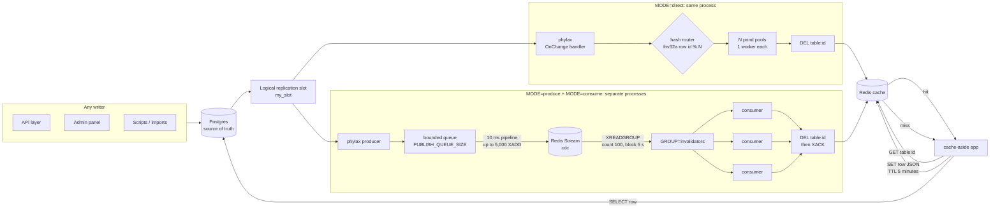

# redis-cdc-invalidation

A worked implementation of the Cache-Invalidation-via-CDC design — not a shrink-wrapped program. It exists to prove the pattern end to end (with measured numbers) and to be copied from: watch Postgres's write-ahead log (WAL) and delete the matching Redis key on every insert, update, and delete — from any writer, with zero polling.

## The problem

A cache is only correct if every write path remembers to invalidate it: API handlers, admin panels, one-off scripts, bulk imports, migrations. Miss one path and you serve stale data indefinitely — and the miss is silent, so you find out from users, not alerts. As writers multiply, manual invalidation rots.

This project flips the responsibility: instead of every writer notifying the cache, one watcher observes committed data and invalidates. New writers are covered automatically because coverage comes from the database, not from code paths.

## How it works



Choose one invalidation path per deployment. In `direct` mode, phylax runs hash routing and invalidation in the same process. In stream mode, `MODE=produce` turns WAL events into stream records, while one or more independent `MODE=consume` processes share the consumer group and invalidate separately.

`Write → Postgres commits → WAL event → stream or router → DEL the key → next read repopulates from Postgres`

Each stage exists for a specific reason:

- **Postgres WAL (not triggers, not polling).** Every committed change is already in the write-ahead log, so watching it adds no overhead to writes and never misses a commit. Triggers would tax every write; polling would always be late.
- **Replication slot (not a plain connection).** The slot (`my_slot`) forces Postgres to retain WAL until this app acknowledges it. If the app restarts, it resumes where it left off. Without the slot, downtime means silently missed writes.
- **[phylax](https://github.com/codetesla51/phylax) (not hand-rolled replication).** Logical replication's sharp edges — slot/publication lifecycle, keepalives, standby-status timing, reconnect with backoff, LSN resume — are handled by the library. The app implements one callback: `OnChange`.
- **Hash router (not random dispatch).** `pool = fnv32a(id) % N` sends every change for one row ID to the same pool, so per-key order is preserved, while different IDs scatter across pools for parallelism. Same trick as Kafka partition keys. FNV because it needs to be fast and deterministic, not cryptographic.
- **Producer queue (stream mode).** `MODE=produce` skips the router and sends each row-bearing WAL event to a bounded publisher queue. Flushes happen every 10 ms as one Redis pipeline, up to 5,000 `XADD`s per flush; if the queue is full, the overflow is logged instead of blocking WAL handling.
- **Redis Stream handoff (stream mode).** The stream preserves append order and is capped with an approximate maximum length of 100,000 entries, so an inactive consumer group cannot grow it without bound.
- **Consumer group (stream mode).** Each `MODE=consume` process joins `GROUP`, reads new entries with `XREADGROUP`, deletes the corresponding cache key, then acknowledges the entry. Unacknowledged entries remain pending and can be redelivered, giving at-least-once delivery; malformed entries are left unacknowledged for inspection.
- **One worker per pool (not a shared thread pool).** Each pond pool runs a single task at a time, so two rapid updates to the same row invalidate in commit order. Raise a pool to 2+ workers and an older state can win the race — the design collapses to "usually correct," which is broken. Across pools, all N run concurrently.
- **`DEL` (not recompute).** Delete-then-lazy-repopulate is one Redis round trip with no serialization code to rot, and it is idempotent — replayed WAL events are harmless. Recompute only pays off for keys so hot a cold miss hurts; measure before switching.
- **TTL backstop (not the primary path).** Cached rows expire after 5 minutes, so even a missed `DEL` self-heals. `DEL` does the real work; TTL bounds the worst case. Belt and suspenders: a no-op `DEL` costs ~165µs (measured), so deletes fire on every write without thinking — and if one is ever missed, dropped, or a key is written while the watcher is down, the TTL deletes it late instead of never. Nothing stays stale forever unless *both* fail at once.

## Reads: cache-aside

`getProduct` checks Redis first. On a miss (or corrupt entry, or Redis being down) it reads Postgres and repopulates Redis:

```go
store := NewStore(rdb, pool)
data, err := store.Get(ctx, "products", "p1") // row JSON; any table with an `id` column
if errors.Is(err, ErrNotFound) {
    // id exists in neither cache nor Postgres; misses are never cached
}
```

Cache trouble degrades to Postgres instead of failing the read. A failed `SET` doesn't fail a good row — the next read simply misses again. A circuit breaker skips Redis entirely after 3 consecutive failures (5s cooldown, then one probe): reads with the cache down cost ~0.2ms instead of ~200ms of dial retries, measured live.

## Cache keys

Keys are `<table>:<id>` (e.g. `products:p1`, `orders:o1`), derived from the change event itself. Watching a new table needs no code change — add it to `TABLES` (plus a one-time `ALTER PUBLICATION my_publication ADD TABLE <table>;`).

## Setup

Postgres needs logical replication; the app needs a database, a watched table, and a cache.

```sh
# 1. Start Postgres (this repo's dev cluster lives at ~/pgdata)
pg_ctl -D ~/pgdata -l ~/pgdata/logfile \
  -o "-k /home/uthman/pgdata -c listen_addresses=localhost" start

# 2. One-time DB config, as superuser (wal_level needs a restart to take effect)
psql -h localhost -U postgres -d postgres \
  -c "ALTER SYSTEM SET wal_level = logical;" \
  -c "CREATE DATABASE redis_cdc;"
# restart, then:
psql -h localhost -U postgres -d redis_cdc \
  -c "CREATE TABLE IF NOT EXISTS products (
        id TEXT PRIMARY KEY,
        name TEXT NOT NULL,
        updated_at TIMESTAMPTZ NOT NULL DEFAULT now());"

# 3. Start Valkey (or Redis) on 6379
valkey-server --daemonize yes --save '' --appendonly no

# 4. Run the watcher (phylax creates its slot + publication itself)
DATABASE_URL='postgres://postgres@localhost:5432/redis_cdc' go run .
```

Adding another table later is two steps, no code change:

```sql
CREATE TABLE orders (id TEXT PRIMARY KEY, item TEXT NOT NULL);
ALTER PUBLICATION my_publication ADD TABLE orders;
```

```sh
TABLES='products,orders' DATABASE_URL='...' go run .
```

## Quick start

With setup done, the console lives at `http://localhost:8080/dashboard` (KPIs, lag sparkline, live change feed, with `/metrics/stream` and `/events` alongside).

Write a row from anywhere — psql, your app, a script:

```sql
INSERT INTO products (id, name) VALUES ('demo1', 'apple');
UPDATE products SET name = 'APPLE' WHERE id = 'demo1';
```

The dashboard's `changes_processed` ticks up once per write, and the next `getProduct("demo1")` repopulates Redis from Postgres. (Per-key log lines were removed after load testing showed `fmt.Printf` at flood rates cost more than the `DEL` itself — flow is visible in the console instead.)

## Configuration

| Variable | Default | Meaning |
|---|---|---|
| `DATABASE_URL` | _(empty)_ | Postgres DSN. Empty means start nothing (handy for running unit tests without a DB). |
| `TABLES` | `products` | Comma-separated tables to watch, e.g. `products,orders`. |
| `REDIS_ADDR` | `localhost:6379` | Redis/Valkey address. Pinged at startup — fail fast if unreachable. |
| `HTTP_ADDR` | `:8080` | Console address. |
| `WORKER_POOLS` | `8` | Router pool count. Must be a positive int; anything else is a startup error. Pools hold no state, so changing this across a restart loses and reorders nothing. |
| `CHANGE_BUFFER_SIZE` | `100` | Per-subscriber WAL change buffer (phylax `v0.3.3+`). Size for the biggest burst (~1KB per change); a full buffer drops rather than stalls. |
| `MODE` | `direct` | Topology: `direct` (phylax straight to pools), `produce` (phylax appends to `STREAM`), `consume` (group worker drains `STREAM` into `DEL`s). |
| `STREAM` | `cdc` | Stream key for produce/consume modes. |
| `GROUP` | `invalidators` | Consumer group workers share; each entry delivered to exactly one worker, `ACK`ed only after its `DEL`. |
| `PUBLISH_QUEUE_SIZE` | `100000` | Producer queue capacity in `produce` mode. A full queue drops entries loudly rather than stalling WAL processing. |

## Scaling out with streams

`direct` mode is the simple single-process path: phylax hashes each row ID to one of the local worker pools and each pool keeps per-key order. It cannot share work across boxes because every process would read the same logical slot and receive every change.

`MODE=produce` splits that path in two: phylax publishes batched `XADD` records to the stream, and each `MODE=consume` process reads a disjoint slice through the shared `GROUP`:

Consumers in the same `GROUP` share the stream. Redis gives each entry to one consumer, the consumer deletes the cache key, and only then acknowledges the entry. Unacknowledged entries remain pending for redelivery, so the delivery contract is at-least-once. `DEL` is idempotent, so replay and out-of-order delivery are harmless.

```sh
# box 1: Postgres WAL → stream
DATABASE_URL='...' TABLES='products' MODE=produce /tmp/opencode/cdc-load

# boxes 2..N: stream → Redis DEL
MODE=consume STREAM=cdc GROUP=invalidators /tmp/opencode/cdc-load
```

The producer batches `XADD`s every 10ms and each consumer records applied counts in `cdc:stats:<group>`. The count is a benchmark/health signal, not part of correctness.

### What fan-out has been proven to do

A 30-second, 500-key flood at roughly 3.7k writes/sec produced 110,000 successful writes on both legs:

| Consumers | Work distribution | Group backlog |
|---|---|---|
| 1 | 109,999 invalidations handled by the one worker | 29–98 during the run, then drained |
| 4 | About 27,500 per worker, evenly split | Drained to 0 during the run |

Database P99 stayed effectively unchanged (35ms vs 37ms). More consumers improve the invalidation stage's ability to keep up; they do not make Postgres commits faster. This proves the sharing mechanism from 1 to 4 consumers, not an unlimited 10,000-consumer capacity.

### Local proof

One insert still goes through the complete path: key gone, stream entry present, group backlog empty. The full benchmark record is in [`docs/benchmarks.md`](docs/benchmarks.md).

## Monitoring

`cdcStream` supervises replication and the console as one unit: either side dying takes the other down, and Ctrl-C shuts both down gracefully. While running, watch:

- `changes_processed` — should tick once per committed row change; compare against your write rate.
- `changes_dropped` — must stay 0; drops mean a subscriber can't keep up (see Benchmarks for the one time it didn't).
- `replication_lag_bytes` — a plateau during writes is pipeline depth; a climb means the consumer is falling behind; check `pg_replication_slots` on Postgres if it grows while this app is stopped.
- Error log — only invalidation failures are logged; the hot path is silent by design.

## Benchmarks

Write floods to 1.19M (100% success, P99 103ms, zero drops), invalidation lag
p50 7.5ms / p99 13ms, hits at 0.06ms vs misses at 0.28ms, a tamed 30-reader
stampede, plus SIGKILL-replay and Redis-down chaos runs. Full tables,
methodology, and lessons in [docs/benchmarks.md](docs/benchmarks.md).

## Tests

```sh
go test -race ./...
```

Pure unit tests (hash stability, cross-key spread, same-key ordering under `-race`, key format, pool-count defaults) always run. Tests touching Postgres/Redis use the local defaults above and skip when unreachable. The live suite proves the whole contract: miss populates, hit serves stale, invalidate refreshes, unknown IDs stay uncached.

## Things to watch out for

- **Lag is inherent, not zero.** Commit → WAL → handler → Redis is milliseconds. If a path needs read-your-write, add a targeted inline invalidation there alongside CDC.
- **`REPLICA IDENTITY`.** With the default, Postgres ships old-row data only for primary-key changes. Deletes and key updates work; if you ever need old non-key values (e.g. "invalidate the old category listing too"), set `REPLICA IDENTITY FULL` and accept the extra WAL.
- **Slot lag.** While this process is stopped, WAL accumulates in `my_slot`. Alert on slot growth, or restarts replay a mountain.
- **Hot keys.** After `DEL` on a very hot key, concurrent reads can stampede Postgres to repopulate. `singleflight` in `Store.Get` already collapses same-key misses into one flight (measured: 30-reader wall 50ms → 7.6ms); if a key outgrows even that, shorten its TTL or recompute it.
- **At-least-once delivery.** Restarts replay unacknowledged changes. `DEL` is idempotent so replays are harmless — keep any future handlers idempotent too.
- **Shutdown.** Both SIGINT (Ctrl-C) and SIGTERM (`kill`) stop replication and the console gracefully. Note that `kill %1` won't stop a `go run` child in scripts; kill the `exe/pkg` PID.
- **Key format.** Keys are `products:p1`, not `product:p1`. Don't mix binaries across the rename.

## Project layout

| File | Responsibility |
|---|---|
| `main.go` | Wiring: env config, phylax watcher, supervised console, `rowID` extraction |
| `router.go` | Hash dispatch to N single-worker pools (`Owner`, `Dispatch`, `StopAndWait`) |
| `cache.go` | Redis client, `<table>:<id>` keys, idempotent `DEL` |
| `store.go` | Table-agnostic cache-aside `Store.Get`, `singleflight` stampede guard, `ErrNotFound` |
| `router_test.go`, `cache_test.go`, `store_test.go` | Unit + live tests (live ones skip without local PG/Redis) |
| `benchmarks/`, `docs/benchmarks.md` | Load configs + full benchmark report |
